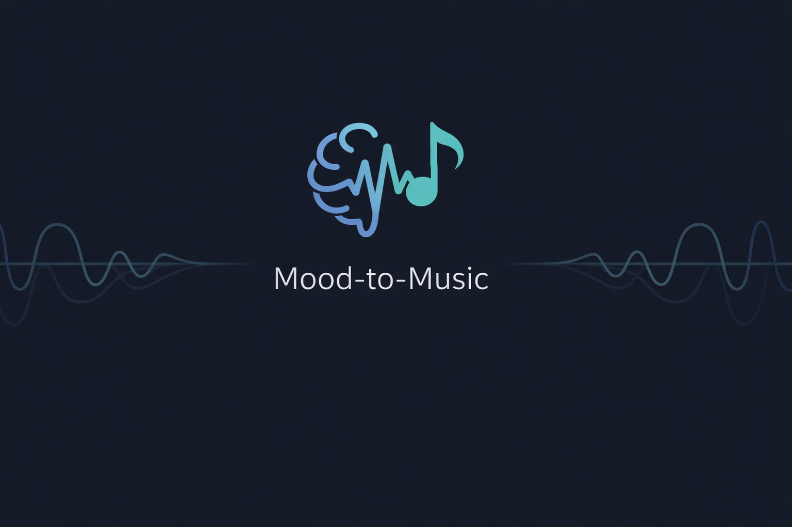
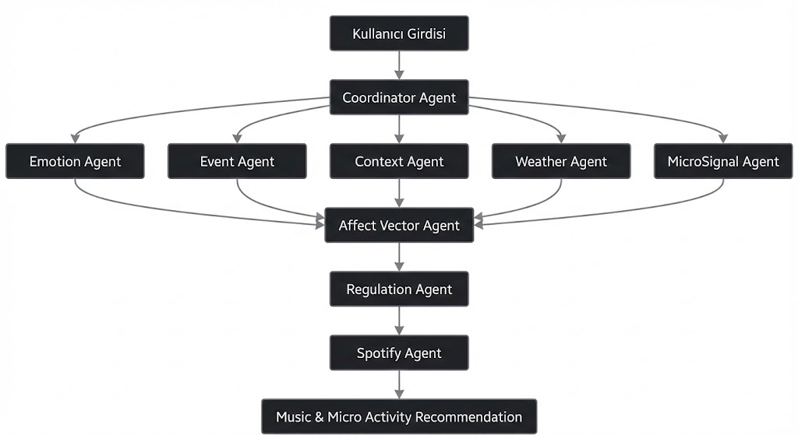
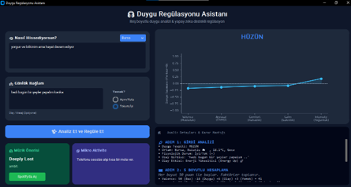
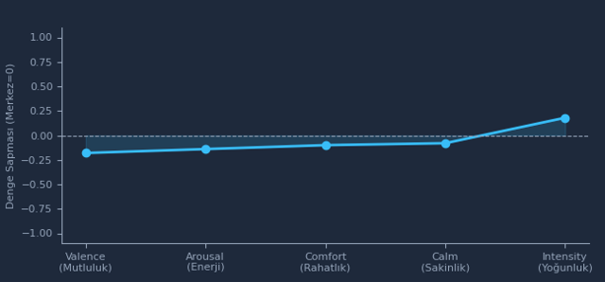
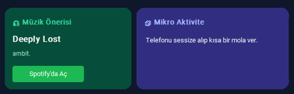
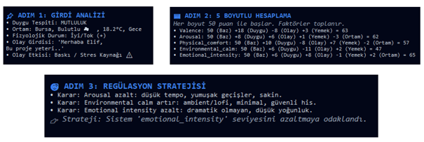

<div align="center">
  
</div>

<div align="center">

# 🎧 Mood-to-Music  
### Duygu Farkındalıklı Müzik ve Regülasyon Asistanı


<br>

> **Kullanıcının duygusal dengesini bulmasına yardımcı olan,<br>
çok ajanlı (multi-agent) müzik ve mikro aktivite öneri sistemi.**

</div>

---

## 📌 İçindekiler
- [Proje Hakkında](#-proje-hakkında)
- [Sistem Mimarisi](#-sistem-mimarisi)
- [Kullanılan Ajanlar](#-kullanılan-ajanlar)
- [Özellikler](#-özellikler)
- [Ekran Görüntüleri](#-ekran-görüntüleri)
- [Kurulum & Çalıştırma](#-kurulum--çalıştırma)
- [Proje Yapısı](#-proje-yapısı)
- [Teknolojiler](#-teknolojiler)
- [Ekip](#-ekip)
- [Lisans](#-lisans)

---

## 📖 Proje Hakkında

**Mood-to-Music**, klasik tek etiketli duygu analizinin ötesine geçerek, kullanıcının duygusal durumunu **5 farklı boyutta** analiz eden yapay zeka tabanlı bir **Duygu Regülasyon Asistanıdır**.

Sistem; kullanıcının yazılı ifadesini, günlük bağlamını (olaylar, mesajlar), mikro geri bildirimlerini (örn. yemek durumu) ve çevresel faktörleri (hava durumu, zaman) bir araya getirerek yalnızca mevcut ruh halini değil, bu ruh halinin **dengeye göre konumunu** anlamlandırır.

Amaç, sadece kullanıcının moduna uygun müzik önermek değil; kullanıcıyı **daha dengeli (homeostatik)** bir duygu durumuna yönlendiren terapötik bir akış sunmaktır.

### Temel Hedefler

Kullanıcının duygusal durumu şu vektörler üzerinden modellenir ve **0–100** aralığında tutulur:

1. **Valence** – Pozitif / Negatif duygu yükü  
2. **Arousal** – Uyarılma / enerji seviyesi  
3. **Physical Comfort** – Fiziksel rahatlık  
4. **Environmental Calm** – Çevresel sakinlik  
5. **Emotional Intensity** – Duygu yoğunluğu  

> ℹ️ Grafik gösteriminde **50 değeri denge noktası** kabul edilir ve görselleştirme için değerler `[-1, +1]` aralığına normalize edilir.

---

## 🧠 Sistem Mimarisi

Uygulama, merkezi bir **CoordinatorAgent** tarafından yönetilen, görevleri net biçimde ayrıştırılmış **çok ajanlı (multi-agent)** bir mimariye sahiptir.



Bu mimaride:

- **Kullanıcı girdisi**, tüm süreci yöneten **CoordinatorAgent** tarafından alınır  
- Duygu, olay, mikro sinyal ve bağlam bilgileri **bağımsız ajanlar** tarafından analiz edilir  
- Bu çıktılar **Affect Vector Agent**’ta birleştirilerek 5 boyutlu duygusal durum vektörü oluşturulur  
- **RegulationAgent**, mevcut durum ile hedef denge arasındaki farkı hesaplar  
- **SpotifyAgent**, bu regülasyon hedefine uygun müzik önerisini üretir  

Bu yapı sayesinde sistem:
- Modüler  
- Genişletilebilir  
- Açıklanabilir (explainable AI)  
bir karar akışına sahiptir.

---

## 🤖 Kullanılan Ajanlar

| Ajan                  | Görev                                                                                  |
| --------------------- | -------------------------------------------------------------------------------------- |
| **CoordinatorAgent**  | Tüm ajanların çalışmasını koordine eder, veri akışını yönetir ve nihai çıktıyı üretir. |
| **EmotionAgent**      | Türkçe metin üzerinden duygu analizi (BERT + Rule-based + LLM).                        |
| **EventAgent**        | Günlük olayların kullanıcı üzerindeki etkisini analiz eder.                            |
| **MicroSignalAgent**  | Küçük geri bildirimleri (örn. açlık/tokluk) sayısal katkıya dönüştürür.                |
| **ContextAgent**      | Zaman bilgisi ve genel bağlamı sisteme dahil eder.                                     |
| **WeatherAgent**      | Hava durumu verilerini (WeatherAPI) alarak çevresel bağlama ekler.                     |
| **AffectVectorAgent** | Verileri 5 boyutlu duygu vektörüne (0–100) dönüştürür.                                 |
| **RegulationAgent**   | Mevcut durum ile hedef denge arasındaki farkı hesaplar.                                |
| **SpotifyAgent**      | Regülasyon hedefine uygun müzik önerir.                              |

---

## ✨ Özellikler

* ✅ **Çok Boyutlu Duygu Analizi**
* ✅ **Regülasyon Odaklı Yaklaşım**
* ✅ **Dengeye Göre Normalize Grafikler**
* ✅ **Bağlam Farkındalığı (hava durumu, zaman, olay)**
* ✅ **Spotify API ile Akıllı Müzik Seçimi**
* ✅ **Mikro Aktivite Önerileri**
* ✅ **Şeffaf Karar İzleri ve Debug Paneli**

---

## 📷 Ekran Görüntüleri

### 🖥️ 1) Ana Arayüz – Genel Akış



Bu ekran, uygulamanın **merkezi kontrol panelini** göstermektedir.

**Bu ekranda:**
- Kullanıcı duygu durumunu serbest metin olarak girer  
- Günlük olay (event) ve mikro sinyal (yemek durumu) bilgileri eklenir  
- Analiz başlatıldığında tüm ajanlar zincirleme şekilde çalışır  
- Sağ panelde duygu durumu özeti ve grafik anlık güncellenir  

---

### 📈 2) Duygusal Durum Grafiği (5 Boyutlu)



Bu grafik, kullanıcının duygusal durumunun **dengeye göre sapmasını** gösterir.

**Önemli noktalar:**
- Her eksen bir duygusal boyutu temsil eder  
- **50 değeri denge noktasıdır**  
- Görselleştirme için değerler `[-1, +1]` aralığına normalize edilmiştir  
- Regülasyon öncesi durumun sezgisel olarak anlaşılmasını sağlar  

---

### 🎵 3) Müzik ve Mikro Aktivite Önerisi



Analiz ve regülasyon sonucunda kullanıcıya:

- Spotify üzerinden önerilen müzik  
- Küçük ama etkili bir **mikro aktivite** sunulur  

Bu adım, duyguyu bastırmak yerine **nazikçe dengelemeyi** hedefler.

---

### 🧠 4) ⚠️ Yasal ve Etik Uyarı 


Bu uyarı, uygulamanın bir terapi veya teşhis aracı olmadığını,
yalnızca duygusal dengeyi destekleyen öneriler sunduğunu
kullanıcıya açıkça hatırlatmak amacıyla gösterilmektedir.

---

### 🧪 5) Karar İzleri – Kullanıcı Dostu Analiz Açıklaması



Bu bölüm, sistemin **neden bu sonucu verdiğini** kullanıcıya açıklamak için tasarlanmıştır.

**Adım adım şunlar gösterilir:**
1. Nihai duygu sonucu  
2. Olay (event) etkisinin değerlendirilmesi  
3. Mikro sinyal (yemek) katkısı  
4. Çevresel bağlam (şehir, hava, saat)  
5. 5 müzik etmeninin nasıl hesaplandığı  
6. Regülasyon kararlarının gerekçeleri  

> 🎯 Amaç: “Bu müzik neden önerildi?” sorusuna şeffaf bir cevap vermek 

Bu yapı, sistemin **açıklanabilir yapay zeka (Explainable AI)** yaklaşımını destekler.

---

## 🛠 Kurulum & Çalıştırma

### Gereksinimler

* Python 3.9+
* Spotify Developer Hesabı
* Google Gemini API Anahtarı
* WeatherAPI Anahtarı

### Kurulum

```bash
git clone https://github.com/busrayesinn/mood2music.git
cd mood2music
pip install -r requirements.txt
```

### Ortam Değişkenleri

Proje kök dizininde `.env` dosyası oluşturun:

```env
GOOGLE_API_KEY=...
SPOTIFY_CLIENT_ID=...
SPOTIFY_CLIENT_SECRET=...
WEATHER_API_KEY=...
```

### Çalıştırma

```bash
python gui.py
```

---

## 📂 Proje Yapısı

```text
mood2music/
├── agents/              # Tüm ajan sınıfları
├── screenshots/         # README için ekran görüntüleri
├── gui.py               # Uygulama giriş noktası
├── requirements.txt     # Python bağımlılıkları
├── .env                 # Ortam değişkenleri (gitignore)
└── README.md
```

---

## 🧰 Teknolojiler

* **Dil:** Python
* **NLP & AI:** HuggingFace Transformers (BERT), Google Gemini API
* **API’ler:** Spotify Web API, WeatherAPI
* **Arayüz:** CustomTkinter
* **Görselleştirme:** Matplotlib

---

## 👥 Ekip

Bu proje ekip çalışması olarak geliştirilmiştir:

* **[Melike Dal](https://github.com/melikedal)**
* **[Büşra Yesin](https://github.com/busrayesinn)**

---

## 📄 Lisans

Bu proje **MIT Lisansı** altında lisanslanmıştır.
